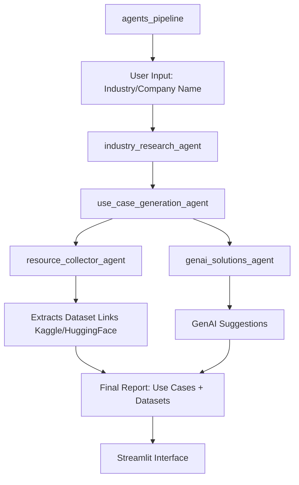

# Market Research & Use Case Generation Agent

An intelligent multi-agent system that performs market research and generates actionable AI/ML and Generative AI use cases, complete with dataset links and solution proposals — all based on a simple input: a company or industry.

---

## Overview

This project leverages a multi-agent architecture to:

- Research a company or industry using real-time search and LLMs.
- Generate relevant, practical use cases for AI, ML, and GenAI adoption.
- Find public datasets (from Kaggle, HuggingFace, etc.) aligned with those use cases.
- Suggest GenAI tools and workflows that can be applied internally or externally.
- Present everything in a clean interface via **Streamlit**.

---

##  Agent Workflow Architecture



---

## Features
- Real-time company/industry research
- LLM-generated AI/ML & GenAI use cases
- Dataset search via HuggingFace & Kaggle
- Streamlit frontend for interactive exploration
- Cli usage available too
---

## Installation

### Prerequisites
- Python 3.9+
- [Poetry](https://python-poetry.org/) for dependency management

### Clone & Install
```bash
git clone https://github.com/RishabhSpark/Market-Research-Using-Mutliple-Agents.git
poetry install

streamlit run app.py
```

### Dependency Management
This project uses [Poetry](https://python-poetry.org/) for dependency management.
All dependencies are listed in pyproject.toml.

## Command Line Interface (CLI) Usage
This project comes with a command-line interface (CLI) that lets you run the entire multi-agent AI pipeline from your terminal.

### Arguments
| Argument             | Description                                                       | Example             |
|----------------------|-------------------------------------------------------------------|---------------------|
| `-h` or `--help`     | The name of the industry or company you want to research.         |                     |
| `<company/industry>` | The name of the industry or company you want to research.         | `'Tesla'`           |

```
python main.py <industry-or-company-name>
```
